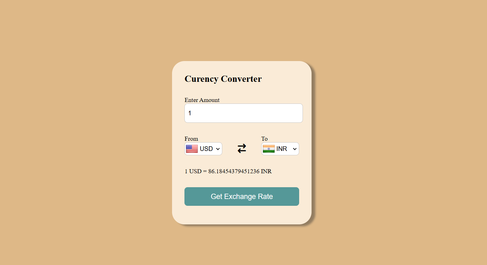

# 💱 Currency Converter

A simple Currency Converter app built using **HTML**, **CSS**, and **JavaScript**.

---

## 🚀 Features
- Converts between multiple currencies
- Real-time exchange using JavaScript logic
- Clean UI and instant output
- User-friendly dropdown and input

---

## 🖼️ Screenshot



---

## 📁 Folder Structure

```text
├── index.html
├── style.css
├── app.js
├── code.js
├── screenshot.png
```
---

## 🌐 Live Demo

[Click here to try it out](https://parmardipika.github.io/Currency_Converter/)

---
**Made with 💕 by Dipika Parmar**
